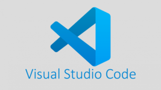
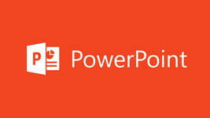
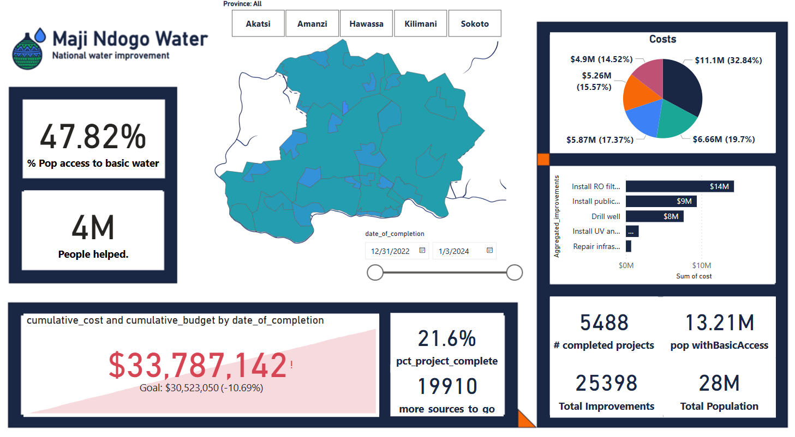
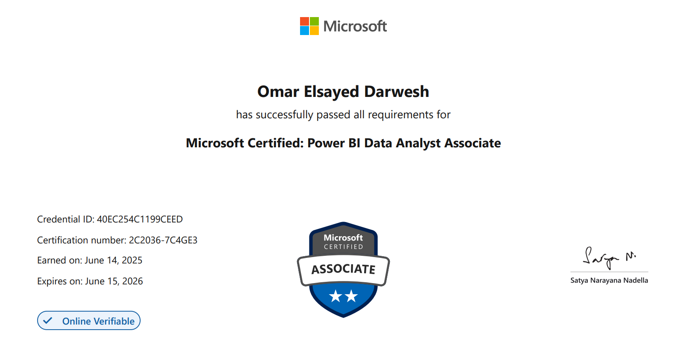
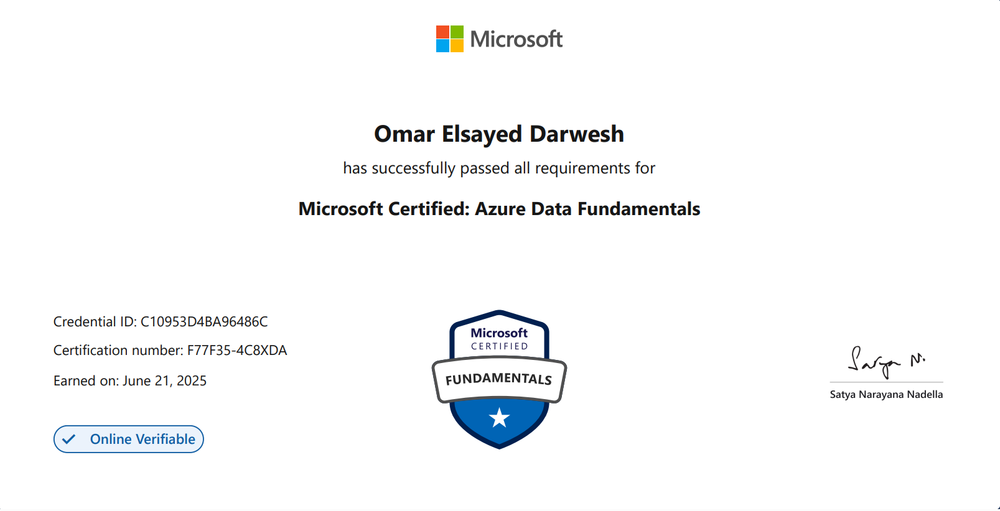

 
 
 

Hi there 👋, 

Let me introduce myself. 

I'm Omar Darwesh.

I'm a Computer Science postgraduate with an analytical mindset and enthusiasm for **Data Analysis**, **Analytics Engineering**, and **Data Engineering**.

 
 
 

## Technical Experience
 

### **Data Science Trainee** 
#### at ALX Africa, Egypt
*Duration: 1.5 years*

- Worked on multiple assignments with tight deadlines.
- Gained expertise in **SQL**, **Python**, **Power BI**, and other key data analysis tools.

 
 

### **Data Analysis Trainee** 
#### at Information Technology Institute (ITI), Ministry of Communication and Information Technology (MCIT), Egypt
*Duration: 5 months*

- Acquired advanced skills in **data cleaning**, **data analysis**, **visualization**, and **reporting**.
- Worked with a variety of tools such as **SQL**, **Excel**, **Python**, **Power BI**, **Tableau**, and more.

 
 
 

---

On a typical day, I worked on developing deliverables such as presentations, dashboards, and reports using tools like **SQL**, **Python**, **Power BI**, **Excel**, **Google Sheets**, **PowerPoint**, **Figma**, and others as needed.

My workflow usually started with exploring and understanding the data—assessing its quality, identifying any issues, and defining suitable approaches to address them. Once the data challenges were tackled and multiple sources were integrated where necessary, I moved on to the design phase.

I began by sketching and shaping the structure of dashboards and reports, ensuring they were not only visually appealing but also informative and purposeful. From there, I built comprehensive dashboards that clearly presented **KPIs** and performance metrics aligned with business objectives.

A key focus throughout was making insights easily understandable for **non-technical stakeholders**, so that data-driven decisions could be made with clarity and confidence.

---

 
 
 

In Jupyter Notebook, Google Colab & VS Code,

  

 
 
 

I used  **Excel**, **SQL**, **Python**, **Google Sheets** for Exploring and Cleaning data existing in files like CSVs and databases like Microsoft SQL Server & MySQL.

   

 

 
 
 

I used **Figma**, **PowerPoint** and **draw.io** for Sketching and Designing a dashboard/report.

 
 
 

I experienced different visualization tools like **Power BI, Tableau, Looker Studio, and Python**.

 

 

 
 
 

A few examples of the type of visualizations I created are like these:

 

 

 
 
 

I know what you're thinking right now. You wanna see a couple of interactive dashboard/report samples.

Kindly have a look at a few Reports/Dashboards for interactive insights I built with **Power BI**:

 

- [Visualizing the Currents of Change — Part 1](https://app.powerbi.com/view?r=eyJrIjoiZmRiODJiZjYtYTA3Mi00ODFjLThmMWYtY2QxZDY4NWI1YzJmIiwidCI6ImRmODY3OWNkLWE4MGUtNDVkOC05OWFjLWM4M2VkN2ZmOTVhMCJ9)
- [Visualizing the Currents of Change — Part 2](https://app.powerbi.com/view?r=eyJrIjoiZDAzZGVjZDAtMDBhYy00ZWI2LTkyOWUtMmFkNGM3ODc3NzZkIiwidCI6ImRmODY3OWNkLWE4MGUtNDVkOC05OWFjLWM4M2VkN2ZmOTVhMCJ9)
- [Visualizing the Currents of Change — Part 3](https://app.powerbi.com/view?r=eyJrIjoiNzdmYjFlNmYtMmIxYi00MTdkLWEwMTAtZDFhMWVkNDU1MWZiIiwidCI6ImRmODY3OWNkLWE4MGUtNDVkOC05OWFjLWM4M2VkN2ZmOTVhMCJ9)
- [Visualizing the Currents of Change — Part 4](https://app.powerbi.com/view?r=eyJrIjoiNmQ5Zjc3NTctMmU3NC00ZjA5LWE1ZjktNDhlM2M1ZjIxNDQ2IiwidCI6ImRmODY3OWNkLWE4MGUtNDVkOC05OWFjLWM4M2VkN2ZmOTVhMCJ9)
- [Visualizing the Currents of Change — Part 5](https://app.powerbi.com/view?r=eyJrIjoiZjFhMmI0OWEtMWU5Yi00YmE0LWE1ZjAtZWJmNGJiNjQzYTQwIiwidCI6ImRmODY3OWNkLWE4MGUtNDVkOC05OWFjLWM4M2VkN2ZmOTVhMCJ9)

---

## Projects

---

 
 
 

##  Certifications

I worked very hard to get certified by Microsoft in **Power BI** and **Azure Cloud**, aiming to deepen my knowledge and gain exposure to higher levels of use cases and data challenges at a more advanced level.

### Microsoft Certified: Power BI Data Analyst:
https://learn.microsoft.com/en-us/users/iamomardarwesh/credentials/40ec254c1199ceed

### Microsoft Certified: Azure Data Fundamentals:
https://learn.microsoft.com/en-us/users/iamomardarwesh/credentials/c10953d4ba96486c

 
 
 

## Education

I joined Cairo University to pursue an academic degree in Computer Science, driven by my ambition to deepen my technical expertise and grow as a professional in the field.

### Cairo University  
**Postgraduate Degree in Computer Science**  
- *Graduated with **Excellent** Standing*  
- **GPA:** 3.7 / 4.0  
- *Graduation Year: 2025*

 
 
 

## Current Professional Development Focus

You might be wondering what I’ve been up to lately.

I’ve been focused on learning/mastering tools like **Fivetran**, **dbt**, **BigQuery**, and **Metabase** through hands-on experience.

My goal here is to build scalable, reliable, and maintainable data solutions that drive real business impact and support better decision-making and long-term growth — from automated pipelines to insightful dashboards.

 
 
 

  
Thanks for visiting my Profile! 

If you'd like to connect, collaborate, or just say hello, feel free to reach out through any of the links below:

Looking forward to hearing from you!

